<Hero slots="heading, text"/>

# Assurance API

Service which provides GraphQL endpoints for Experience Cloud Assurance Tools.

<Resources slots="heading, links"/>

#### Resources

- [Adobe Experience Platform Assurance](https://developer.adobe.com/client-sdks/documentation/platform-assurance/)

## Overview

This documentation provides instructions for Assurance 1.0 APIs. For working with Adobe Experience Platform Assurance, please read the [Assurance documentation](https://developer.adobe.com/client-sdks/documentation/platform-assurance/).

The Assurance APIs are a collection of APIs that empower users to test and debug their web and mobile apps, when outfitted with the Adobe Assurance Mobile SDK. When enabled, the user of these APIs will be able to:

API Explanation:

- createSession: creates a new Assurance Tools session to which a client will ultimately connect.
- updateSession: updates session information, like session name or link.
- sessions (and read annotations): retrieves sessions for a user's organization, along with annotated information.
- deleteSession: deletes a session within a user's organization.
- events (and read annotations): reads event data, and annotations, within a given user's session.

The guide will demonstrate how you can utilize Assurance APIs to programmatically connect your Adobe Assurance enabled mobile application to our back end services to help you develop and debug your application.

**_NOTE:_** Adobe is transitioning to OAuth2.0 as of January 1, 2025. While JWT is still supported until then, you are encouraged to migration to OAuth2.0 for old projects, and use OAuth2.0 for new projects.

In order to make requests into Assurance API, you are by default guided to choose authentication type OAuth2 (Server-to-Server), and alternatively, a JSON Web Token (Deprecated) within the Adobe Developer Console. For further information on use of OAuth2, view [here](https://www.adobe.com/go/devs_s2s_credential_overview). For JWT, you can view helpful docs and explanations [here](https://jwt.io/).

## Granting access

Within the [Admin Console](https://adminconsole.adobe.com/), Administrators will have to add new "Developers", and grant each access to "Adobe Experience Platform". With such access, those developers can create other "Projects" within your organization and add "Assurance" to those projects.

## Creating a project

If you do not already have a project defined in your organization, please create one by selecting **Create new project**.

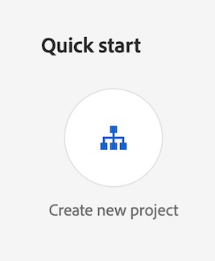

## Adding Assurance API

Within your project home page, click "Add API", filter by "Adobe Experience Platform", select "Assurance", then click "Next".

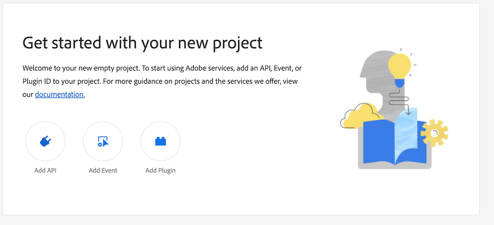

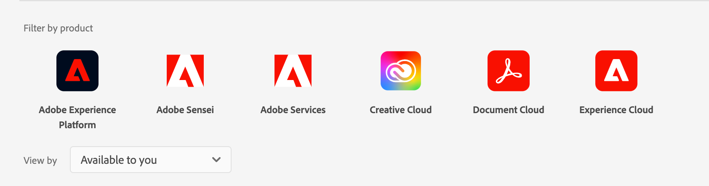

After filtering for Platform, select **Assurance**.

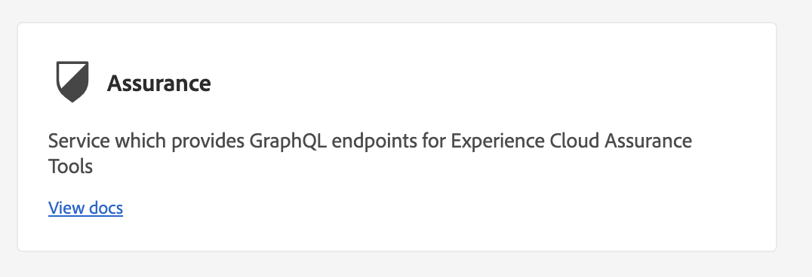

## Public/Private key pairs (if choosing JWT)

You will be prompted to either generate or upload a public/private key pair. Select **Generate Key Pair**.

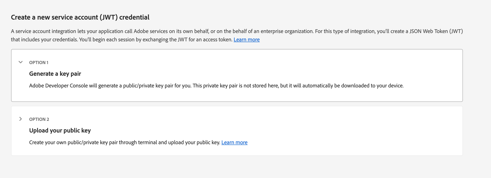

A ZIP file will be generated and downloaded to your computer. Expand the ZIP file and copy the entire contents of "private.key" to your clipboard.

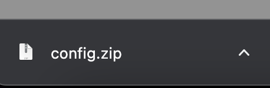

Select **Next** and, if requested, choose an applicable product profile.

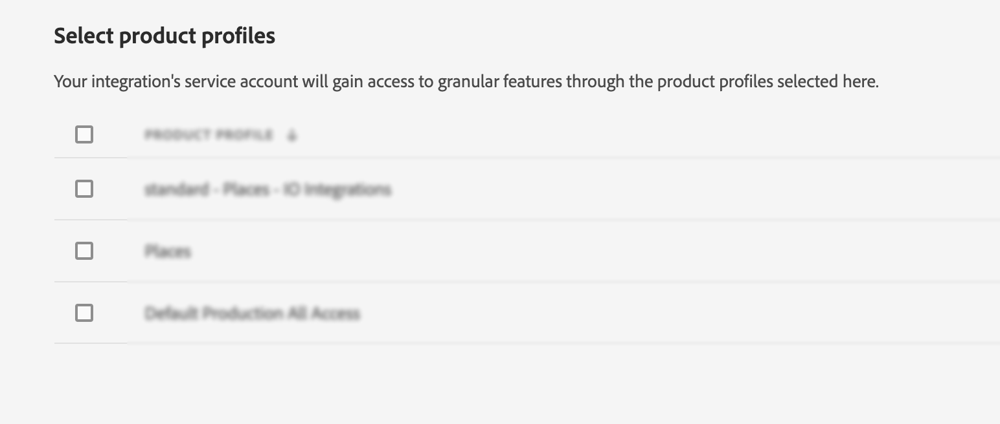

Select **Save configured API** after confirming your details.

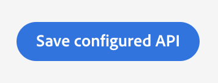

## Generating an OAuth2.0 Token

If instead you chose to employ OAuth2.0 authentication after defining your project you can now generate your access tokens.

## OAuth2.0 Access Token

To generate an access token within your project, navigate to "OAuth Server-to-Server" in the left navigation. Unlike JWT, OAuth2.0 access tokens are generated without the need for downloading a private key. Simply click "Generate access token" and copy the access token to your clipboard. This token will be used to authenticate your requests to the Assurance API.

To generate programmatically, you can use the following cURL command:

```shell
1. export client_id and client_secret variables (both can be copied from developer console OAuth Server-to-Server page).
e.g.
export client_id=2a8fdb0122f443ca9d74c5b367a9da24
export client_secret=<CLIENT SECRET>

2. use this command to generate an access_token
curl -X POST 'https://ims-na1.adobelogin.com/ims/token/v3' -H 'Content-Type: application/x-www-form-urlencoded' -d 'grant_type=client_credentials&client_id=$client_id&client_secret=$client_secret&scope=assurance_read_plugins,assurance_manage_sessions,assurance_read_annotations,openid,assurance_read_session_annotations,AdobeID,additional_info.projectedProductContext,assurance_read_clients,assurance_read_events'

3. export access_token=(access token acquired by above command)

4. export org_id=<ORGANIZATION ID> (org is also on the developer console page)

5. call assurance API
e.g.
curl --request POST \
--url 'https://graffias.adobe.io/graffias/graphql' \
--header 'Authorization: Bearer $access_token' \
--header 'Content-Type: application/json' \
--header 'x-api-key: $client_id' \
--header 'x-gw-ims-org-id: $org_id' \
--data '{"query":"query { sessions { name uuid orgId}}"}'

```

## Generating a JWT (JSON Web Token)

After defining your project, associating it with the Assurance API, and generating a public/private key pair, you can generate your JWT.

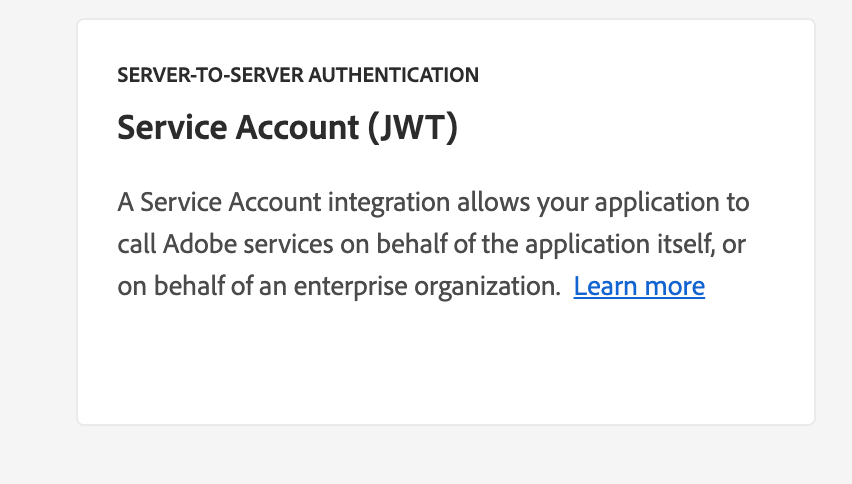

A JWT can be generated within the UI or using [several tools/libraries](https://jwt.io/libraries).

If you are generating your JWT within the UI, paste the entire contents of your previously downloaded private key into the "Private key" text box.

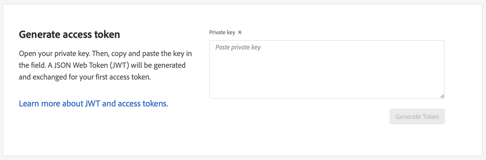

## Status check

Now you should have created or defined the following iteas:

- An access token generated from your unique JSON Web Token
- Client ID
- Client Secret
- Technical Account ID
- Technical Account Email
- Organization ID

## Rotating OAuth2.0 Client Secrets

OAuth2.0 affords the ability to rotate client secrets as needed (instead of automatically expiring as with JWT). See more [here](https://developer.adobe.com/developer-console/docs/guides/authentication/ServerToServerAuthentication/implementation/#rotating-client-secrets).

## Regenerating JWT-exchanged access tokens

To regenerate an access token, select **Credentials / Service Account (JWT)** within your project.

Select the **Generate JWT** tab, paste your private key in the text box, and then select **Generate Token**.

To regenerate your access token, copy and paste the **Sample cURL command** into your terminal and execute it. This command will use the generated JWT and exchanges it for an access token.

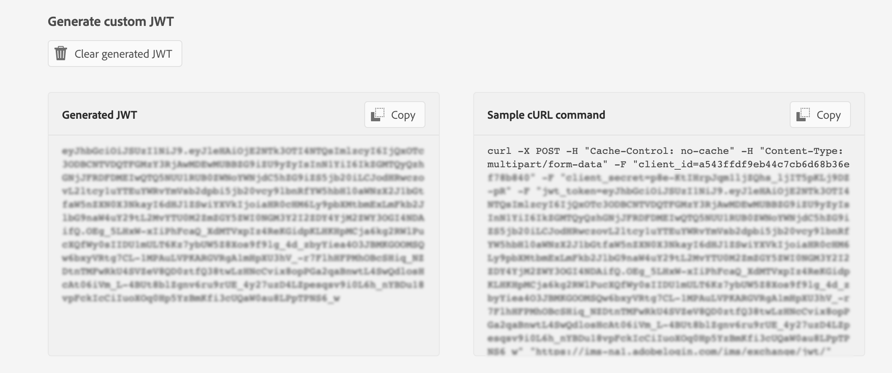

An access token will be returned in your terminal window with a 24 hours expiration period.

## Glossary

- **Access Token**: An expiring token that must be sent in the header value for 'Authorization' in the form -H 'Authorization: Bearer [access token value]'
- **Assurance**: The service which provides GraphQL endpoints for Experience Cloud Assurance Tools
- **Adobe Developer Console**: Gives developers access to the tools needed to build with Adobe, including access to APIs, real-time events, runtime functions, and plugin IDs
- **Client ID**: Identifies which user or entity is gaining access to an Adobe resource, along with an access token, and is passed in the header in the form -H 'x-api-key: [client ID value]'
- **Client Secret**: Confirms the entity using the Client ID is authorized to do so.
- **JSON Web Token (JWT)**: A method for representing claims securely between two parties
- **OAuth2.0**: The industry standard protocol for server-to-server authorization.
- **Organization ID**: Alpha-numeric value assigned to your Organization, ending in "@AdobeOrg"
- **Public/Private Key Pair**: Helps to encrypt information that ensures data is protected during transmission
